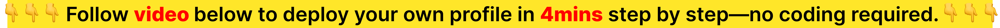

<p align="center">
  <strong>Bento.me was beautiful. When it shut down, we lost something special.<br/>
  We rebuilt it as open-source—not to replace it, but to preserve it.<br/>
  So this vision can live forever.</strong>
</p>

<p align="center">
  <a href="LICENSE"></a>
</p>

<p align="center">
  <em>Inspired by Bento.me · Built by Research AI+ · Preserved for Everyone</em>
</p>

<p align="center">
  <a href="#what-makes-open-bento-me-different">What's Different</a> •
  <a href="#quick-start-5-minutes">Quick Start</a> •
  <a href="#card-types">Card Types</a> •
  <a href="#how-it-works">How It Works</a> •
  <a href="#local-development-optional">Local Development</a> •
  <a href="#join-the-community">Join Community</a> •
  <a href="#license">License</a>
</p>

---

<p align="center">
  
</p>

<p align="center">
  <a href="https://youtu.be/DOl5kSkzTw8">
    
  </a>
  <br/>
  <sub>▶ <a href="https://youtu.be/DOl5kSkzTw8">Watch intro video (4 min)</a></sub>
</p>

<br/>
<br/>

---
## 🙏 In Honor of Bento.me

This project exists because the Bento.me team created something remarkable.

**What they built:**
- ✨ The bento grid layout that made portfolios beautiful
- 🎨 An intuitive visual editor that made design accessible  
- 💡 A philosophy: your work deserves to be showcased beautifully

**What we're preserving:**
- 🏛️ The design language they pioneered
- 🎯 The user experience they perfected
- ❤️ The love they put into every detail

---

## 💔 Why We Needed to Build This

When Bento.me shut down, thousands of us lost more than a tool. We lost:

- 📊 Years of carefully curated work
- 🔗 Custom domains we'd shared everywhere
- 💼 Professional identities we'd built
- 🌐 Links we'd distributed for years

**This wasn't Bento.me's fault.** They built something amazing. But it showed us a hard truth:

> Even the best products—built by talented, dedicated teams—can disappear when companies face business pressures that open-source projects don't have to navigate.

That's why we chose to rebuild this as open-source—not because open-source is "better," but because **permanence matters** for something as personal as your portfolio.


---

## ✨ Why Open-Source?

### 1. Your Data, Your Rules, Forever

We're not here to say open-source is superior to commercial products. Both have their place.

But for a portfolio tool—something that represents your life's work—we believe open-source offers unique advantages:

| What You Get | Why It Matters |
|-------------|----------------|
| 🏠 **Your Own Home** | Hosted on your GitHub—not dependent on any company's survival |
| 🔓 **Complete Freedom** | Modify, fork, or self-host—the code is yours under CC BY-NC-SA 4.0 |
| 🤝 **Community-Driven** | Features built by users who need them, not a product roadmap |
| ♾️ **Permanence** | Even if we disappear, the code lives on GitHub forever |
| 💸 **No Business Pressure** | Build by our community and for the community |

**This isn't commercial vs. open-source.**  
**It's preservation vs. products.**

We loved Bento.me as a product. We're building Open-Bento-Me as a **permanent archive** of that vision.

Your profile can outlive us. Even if Research AI+ disappears tomorrow, your profile stays online. The code is yours.


### 2. Community Innovation Comes First.

Open-source ships what the community needs.

Our community has already added:

- 🔧 GitHub repo cards with live stats
- 🤗 HuggingFace model/dataset showcase
- 🤝 Needboard for collaboration requests
- 📸 Share a card containing QR code and shareable link
- 🌐 Custom domain support
  
Want a new feature? Build it. Submit a PR. Everyone benefits.

### 3. Built by our community, for the community

This is Research AI+, a non-profit community for young technologists--now 600+ member globally including AI researchers, engineers, devs and builders — across academia, big tech, and startups.🚀 

We built it because we needed it. We open-sourced it because we believe in it. We feature cool Open-Bento-Me profiles in our README to make more people know you and make potential connections happen. Want to feature? Send your profile URL to xinranzhang0626@gmail.com or [@Xander_zzzzz](https://x.com/Xander_zzzzz) on X or join our Wechat group (QR code as below).


---

<a id="what-makes-open-bento-me-different"></a>
## 🚀 What Makes Open-Bento-Me Different

### Inspired by Bento.me, Improved by the Community

We loved Bento.me. When it shut down, we decided to:

1. Faithfully recreate what made it great (bento grid, visual editor, instant preview)
2. Add what the community want (innovations below)
3. Open-source everything so it can never disappear again

### Our Innovations

| Innovation | What It Does | Why It Matters |
|------------|--------------|----------------|
| 🎯 No-Code Creation | Pure graphical "click-click-click" — no need to pull code or redeploy | Lower barrier to entry; anyone with a GitHub account can create |
| 🤝 Needboard Card | Showcase what you're seeking/offering for collaboration | Turns your portfolio into a collaboration magnet |
| 📸 Share My Site | Download profile as card containing QR code and sharable link | Easy distribution beyond your homepage |
| 🔧 GitHub/HuggingFace Cards | Display repos and models with live stats | For engineers and researchers who build in public |
| 🌐 Custom Domains | Use your own domain name | True personal branding, not a subdomain |

These features exist because the community requested them. Not because we guessed.


---

<a id="quick-start-5-minutes"></a>
## ⚡ Quick Start (5 Minutes)

  

**For Everyone** (Researchers, Engineers, Founders, Builders, Creators, Designers...)

  

### Step 1: Create Your Repository

- Click the green **"Use this template"** button → Select **"Create a new repository"**

- **Repository name**: We recommend using your name or preferred handle for a clean URL. Your final profile URL will be: `https://username.github.io/[repository-name]/profile`

- **Visibility**: Set to **Public** (required for GitHub Pages on the free plan).

- A new open-source repository will be created under your GitHub account: `https://github.com/username/[repository-name]`

  

### Step 2: Enable Deployment Permissions

- Go to **Settings** → **Actions** → **General** (left sidebar)

- Scroll to **"Workflow permissions"**

- Select **"Read and write permissions"**

- Click **Save**

  

### Step 3: Configure GitHub Pages

- Go to **Settings** → **Pages** (left sidebar)

- Under **Build and deployment** → **Source**, select **GitHub Actions**

  

### Step 4: Trigger First Deployment

- Go to **Actions** tab

- Click **"Deploy to GitHub Pages"** on the left

- Click **Run workflow"** → select `main` → click green button

- Wait 2-3 minutes for build to complete

  

### Step 5: Visit Your Profile

Your empty profile is now live at:

- If repo name is `jane-doe` → `https://username.github.io/jane-doe/profile`

- If repo name is `john-doe` → `https://username.github.io/john-doe/profile`

  

### Step 6: Edit & Publish

- Visit your profile URL with `?mode=edit` appended: `https://username.github.io/[repository-name]/profile/?mode=edit`

- Click **Edit** button to enter editing mode

- Add your bio, avatar, social links, and interests

- Add cards: links, GitHub repos, HuggingFace models, images, and more

- Click **Preview** button to see the result

- Click **Publish** button to push your data to GitHub

  

### First-Time Publish Setup

When you click **Publish** for the first time, you'll need:

- **GitHub Personal Access Token**
	- Go to [github.com/settings/tokens](https://github.com/settings/tokens)
	- Click "Generate new token (classic)"
	- Select the `repo` scope
	- Copy the generated token

- **Repository URL**

	- Format: `https://github.com/username/[repository-name]` (this is the url of the new open-source repository that was created under your GitHub account previously)

- **Branch**: Leave as `main` (default)

**Your credentials are cached in the browser — you won't need to enter them again.**

After publishing, GitHub Actions will automatically rebuild and deploy your site in 2-3 minutes.


> How does this work? When you add ?mode=edit to your URL, the site switches from read-only mode to edit mode. Your published profile data (from profile-config.json) is automatically imported into your browser's localStorage, where you can edit it freely. When you publish, the updated data is pushed back to GitHub and your site rebuilds.


> Is it safe? Yes! Only you (with your GitHub PAT) can publish changes. Other visitors who add ?mode=edit can only see the editor UI, but any changes they make stay in their own browser and cannot be pushed to your repository without your token.


---

## 🎨 Who This Is For

Anyone who creates things and wants to showcase them:
- 💻 Engineers — GitHub repos, side projects, open-source work
- 🔬 Researchers — Papers, HuggingFace models/datasets, research projects
- 🚀 Founders — Product launches, press, traction
- 🎨 Designers — Personal website, Portfolio with Figma, Behance, case studies
- ✍️ Builders & Creators — Passion projects, Published articles, posts, newsletters
  
If you make things, this is for you.


---

<a id="card-types"></a>
## 🎨 Card Types

Build your profile with these cards:

| Card | Description |
|------|-------------|
| 🔗 Link | Share websites, articles, or any URL (auto-fetches title & image) |
| 💻 GitHub Repo | Display your repositories with stars, language, and description |
| 🤗 HuggingFace | Showcase your models or datasets with downloads and likes |
| 📸 Image | Upload photos, designs, or screenshots |
| ✍️ Text | Rich text content with formatting |
| 🏷️ Section Title | Organize your cards with section headers |
| 🤝 NeedBoard | Show what you're seeking and offering for collaboration |

Community is actively building more. 


---

<a id="how-it-works"></a>
## 🔧 How It Works

### Architecture

```
Browser Editor → LocalStorage → GitHub API → Your Repo
                                              ↓
                                        GitHub Actions
                                              ↓
                                        GitHub Pages
                                              ↓
                                   Your Profile (Live)
```

Your data never touches our servers. It goes directly from your browser to your GitHub repo.

### Tech Stack

- Next.js 15 — React framework with static export
- Tailwind CSS + Radix UI — Styling & components
- react-grid-layout — Drag-and-drop grid
- GitHub Pages — Free static hosting
- GitHub REST API — Publish data without a backend
  


---

<a id="local-development-optional"></a>
## 🛠️ Local Development (Optional)

If you want to run the project locally:

```bash
# Clone your repository
git clone https://github.com/researchaiplus/open-bento-me
cd open-bento-me

# Install dependencies
pnpm install

# Start development server
pnpm dev

# Open http://localhost:3000/profile
```

---

## 🔐 Security

- Your GitHub token is stored base64-encoded in browser localStorage
- Token is sent directly from your browser to GitHub API (no middleman server)
- Only repo scope is needed
- Token can be revoked anytime
  
Best Practices:

- Use a dedicated token just for this profile
- Don't commit tokens to git
- Clear browser data when using shared/public computers
  

---

## 🤔 What About Other Alternatives?

After Bento.me shut down, other companies launched similar products. **That's great!** The more beautiful portfolio tools, the better for creators.

**So why choose open-source?**

Both commercial and open-source products have their strengths:

| Commercial Product | Open-Source (Us) | The Philosophy |
|-------------------|------------------|----------------|
| ✅ No deployment needed | ⏱️ 5-minute GitHub setup | We chose **ownership** over instant convenience |
| ✅ Professional support | 🤝 Community support | We chose **sustainability** over SLAs |
| ✅ Managed hosting | 🏠 Self-hosting | We chose **control** over hand-holding |
| ✅ Company roadmap | 👥 User-driven features | We chose what **creators need** over what sells |

**Both approaches are valid. Choose what fits your values:**

- Want convenience and professional support? → Choose a commercial product
- Want ownership and permanence? → Choose open-source

**We're not fighting anyone.** Commercial products serve many people well. We're simply offering an alternative for those who value ownership and permanence—both approaches make the ecosystem stronger.

The portfolio ecosystem is better with multiple options. We're just one of them—the one that can never shut down.


---

## 🚀 Powered by [Research AI+](https://github.com/researchaiplus)

**Research AI+**, a non-profit community for young technologists—now 600+ members globally including AI researchers, engineers, devs and builders—across academia, big tech, and startups. 🚀

### Our Story

Research AI+ began in the most organic way. A small group came together: senior engineers from big tech, young professors from top universities, and even a few founders. We all shared the same drive— to test ideas, to build things, to make a real-world impact.

We noticed creators who could publish papers, deploy models, design products, and build prototypes—but had no good way to represent that multidimensional identity. When Bento.me shut down, it became clear: portfolios need to outlive companies.

### Our Belief

Connections matter most—especially in an era of rapid AI progress.

The best ideas emerge from:

- ✨ Motivation: People who build because they care
- 🌍 Diversity: Bridging disciplines, academia ↔ industry, borders
- 🤝 Connection: IRL experiences, casual chats that spark projects

### Our Vision

To break down walls:

- 🔬 Between disciplines 
- 🏢 Between academia and industry
- 🌏 Across borders and cultures
  
We'd love to invite you to join us and help shape what tech looks like in the AI era.


---

<a id="join-the-community"></a>
## 🌟 Join the Community

Open-Bento-Me is built and maintained by Research AI+. Not just users—contributors.

### 🤝 Connect With the Community

| Platform | Link | What You'll Find |
|----------|------|------------------|
| 💬 Wechat group |  | Join 600+ AI Researchers, Engineers, Research Founders and AI Builders. Daily discussions, news, collaborations, fellow connections, community private events. |
| 💡 Wechat subscription |  | Deep, source-driven reads on frontier AI, from top-conference papers to industry reports, with both researchers' and engineers' focus on real world impact. Also updates, events and community highlights. |
| 📚 Rednote |  | Deep, source-driven reads on frontier AI, from top-conference papers to industry reports, with both researchers' and engineers' focus on real world impact. Also updates, events and community highlights. |
| 📧 Newsletter (Substack) | [Subscribe](https://researchaiplusweekly.substack.com/) | Technical insights, community spotlights |
| 🎤 Interviews | Research: Side B (included in Wechat Subscription / Substack Newsletter / Redenote) | Interviews with emerging researchers, engineers and technical founders |
| 🌐 Events | [Event 1](https://x.com/Xander_zzzzz/status/1973298346531102755?s=20)<br/>[Event 2](https://mp.weixin.qq.com/s/9DpgcyvHe_Js1Lp8Am9saQ) | Salons, conference meetups, workshops, hackathons, talks, parties... More events recap on Wechat Subscription / Redenote |
| 🐦 X Founders | [@Xander_zzzzz](https://x.com/Xander_zzzzz)<br/>[@Liz_LizLi](https://x.com/Liz_LizLi) | Updates and community highlights; AI Research paper, Engineering; Engineering + Start-up + Open Source + AI Production |


---

## 🤝 Contributing

This project lives because people contribute.

### Ways to Contribute

1. 🎨 Build a New Card Type
   
  - See a card you wish existed? Build it!
  - Submit a PR → we'll merge if it's high quality

2. 🐛 Report Bugs
   
  - Open an issue
  - Include screenshots, expected vs actual behavior

3. 💡 Propose Features
   
  - Start a discussion
  - Get feedback before building

4. 📣 Share Your Profile
   
  - We feature cool Open-Bento-Me profiles in our README to make more people know you. Want to feature? Send your profile URL to xinranzhang0626@gmail.com or [@Xander_zzzzz](https://x.com/Xander_zzzzz) on X or join our Wechat group (QR code as below).


  
5. 📚 Improve Docs
   
  - Found something confusing? Fix it!
  - Documentation is code

### Development Workflow

```bash
# Fork → Clone → Create branch
git checkout -b feature/music-card

# Build → Test → Commit
git commit -m 'Add music card with Spotify integration'

# Push → Open PR
git push origin feature/music-card
```

---

<a id="license"></a>
## 📄 License

**CC BY-NC-SA 4.0** (Creative Commons Attribution-NonCommercial-ShareAlike 4.0 International)

- ✅ Use for personal and non-commercial purposes
- ✅ Modify and adapt the code
- ✅ Share and distribute (under the same license)
- ❌ Commercial use not permitted without a separate license

**Requirements:** Attribution to Research AI+, same license for derivatives, and brand preservation (see [LICENSE](LICENSE) for full terms).

See [LICENSE](LICENSE) for details.


---

## 🙏 In Memory of Bento.me

This project wouldn't exist without the vision and execution of the Bento.me team. Every line of code, every design decision, every feature—it all traces back to what they built first.

**We are standing on the shoulders of giants.**

If this project succeeds, the credit belongs to them. They created the blueprint. We're building on their foundation.

Thank you for showing us what portfolios could be.

### 🎥 Authors

- **[Liz](https://x.com/Liz_LizLi)** — Core Development and Architecture
- **[Xinran](https://x.com/Xander_zzzzz)** — Product & Design & part of Front-end Development

### 📢 Acknowledgments

We'd like to thank the following people who contributed to this project:

| Name | Contributions |
|------|---------------|
| [Chijiang](https://github.com/chijiang) | Support on data-layer exploration and development, feature debugging, and issue triage |

This project lives because people contribute. Wait for you to build more!

---

<p align="center">
  <strong>Open-source Bento.me revival</strong><br/>
  <sub>Beautiful portfolio builder for GitHub Pages. Deploy in 5 minutes or self-host. A tribute to Bento.me.</sub>
</p>


<p align="center">
  <sub>Built with ❤️ by <a href="https://github.com/researchaiplus">Research AI+</a></sub>
</p>
